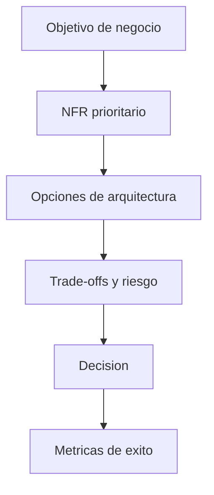

# 01 - Fundamentos de Arquitectura

## Resumen ejecutivo (1 pagina)

- La arquitectura es una disciplina de decisiones bajo incertidumbre, no una lista de tecnologias.
- Un arquitecto Staff/Lead prioriza NFRs explicitamente (disponibilidad, latencia, seguridad, costo).
- Toda decision relevante debe dejar evidencia (ADR) y metrica de exito verificable.
- El objetivo es maximizar valor de negocio con riesgo controlado y complejidad sostenible.
- Sin trade-offs explicitos, la arquitectura deriva en deuda tecnica y baja velocidad de entrega.

## Objetivo

Construir criterio para tomar decisiones tecnicas con impacto en negocio, no solo elegir tecnologias.

## 1) Principios que gobiernan el diseno

| Principio | Que busca | Senal de mala aplicacion |
| --- | --- | --- |
| Separation of Concerns | Limites claros por responsabilidad | Modulos "Dios" |
| High Cohesion / Low Coupling | Cambios localizados | Cambios que rompen todo |
| DRY | Evitar duplicacion accidental | Duplicacion semantica |
| KISS | Reducir complejidad innecesaria | Frameworkitis |
| YAGNI | Evitar sobreingenieria | Infraestructura ociosa |

## 2) Atributos de calidad (NFR)

- Escalabilidad
- Disponibilidad
- Latencia
- Seguridad
- Mantenibilidad
- Testabilidad
- Observabilidad
- Eficiencia de costos

### Matriz de conflicto tipica

| Prioridad alta | Impacta negativamente | Mitigacion |
| --- | --- | --- |
| Latencia muy baja | Costo y simplicidad | Caching + perfiles de trafico |
| Seguridad extrema | Velocidad de entrega | Controles automatizados en pipeline |
| Alta disponibilidad | Costos infra | SLO por criticidad |

## 3) Pensamiento de trade-offs

Ninguna arquitectura es "mejor" en abstracto. Debe responder a:

1. Cual es el riesgo de negocio mas caro hoy.
2. Que cambio es mas frecuente.
3. Cual es la capacidad real del equipo.

## 4) Ejemplo de decision arquitectonica (ADR resumido)

- **Contexto:** picos de trafico en checkout.
- **Decision:** introducir cache de lectura y cola asincrona para notificaciones.
- **Consecuencia positiva:** menor latencia p95.
- **Consecuencia negativa:** mayor complejidad operativa.

## 5) Diagrama de flujo de decision

## 6) Errores comunes

- Elegir arquitectura por moda.
- Optimizar prematuramente.
- Ignorar costo operativo.
- Definir NFRs sin metrica verificable.

## 7) Caso real end-to-end (retail digital)

### Problema

El negocio crece 4x en fechas pico y la plataforma pierde ventas por degradacion de performance.

### Opciones evaluadas

| Opcion | Ventaja | Desventaja |
| --- | --- | --- |
| Escalar solo infraestructura | Rapido | Costo alto y efecto temporal |
| Reescritura completa | Limpieza total | Riesgo extremo y plazos largos |
| Evolucion por dominios criticos | Riesgo acotado | Requiere disciplina tecnica |

### Decision recomendada

Evolucion incremental sobre los dominios de mayor impacto (checkout, catalogo, pagos), con NFRs explicitados por servicio.

### KPIs esperados

- p95 de checkout < 400ms.
- Error rate < 0.5%.
- Disponibilidad mensual > 99.9%.
- MTTR < 30 min.

### Riesgos y mitigaciones

- **Riesgo:** optimizacion local sin impacto global.  
  **Mitigacion:** tablero unico de KPIs de negocio + tecnica.
- **Riesgo:** deuda tecnica oculta.  
  **Mitigacion:** ADR y roadmap de remediacion por trimestre.

## 8) Preguntas de entrevista (Staff/Lead)

- Que NFR priorizarias para un flujo de pago y por que?
- Como justificas una decision tecnica frente a costo y time-to-market?
- Que senales te indican que la arquitectura debe cambiar?

## 9) Errores tipicos en entrevistas

- Hablar de herramientas sin conectar con NFRs y objetivos de negocio.
- Defender una unica arquitectura "ganadora" sin contextualizar trade-offs.
- No mencionar metricas concretas para validar decisiones.
- Confundir opinion tecnica con evidencia operativa.

## 10) Respuesta modelo para entrevista (2 minutos)

"Cuando abordo fundamentos de arquitectura, empiezo por el objetivo de negocio y priorizo NFRs explicitos. No elijo tecnologia por moda: primero identifico riesgo principal, luego comparo alternativas con trade-offs de costo, velocidad y complejidad operativa. Documento la decision en ADR con metricas concretas, por ejemplo p95, error rate y disponibilidad. Finalmente, valido en produccion con observabilidad y reviso si la decision sigue siendo correcta segun el contexto. Mi criterio es evolucion incremental con evidencia, no redisenos impulsivos."
