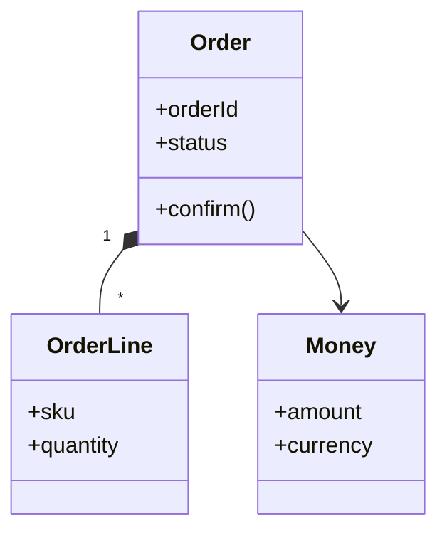

# 03 - Patrones de Diseno y DDD Tactico

## Resumen ejecutivo (1 pagina)

- Los patrones de diseno reducen complejidad local cuando se aplican con criterio.
- DDD tactico protege consistencia del dominio y mejora lenguaje compartido con negocio.
- Aggregate bien definido evita transacciones inestables y conflictos de concurrencia.
- El objetivo no es usar "muchos patrones", sino maximizar claridad, testabilidad y evolucion.
- La frontera entre dominio e infraestructura debe mantenerse explicita.

## 1) Patrones de diseño por tipo

### Creacionales
- Factory Method
- Abstract Factory
- Builder
- Prototype

### Estructurales
- Adapter
- Facade
- Decorator
- Proxy

### Comportamiento
- Strategy
- Observer
- State
- Command

## 2) Cuando usar cada uno (resumen)

| Patron | Uso ideal | Riesgo si se abusa |
| --- | --- | --- |
| Strategy | Variantes de reglas de negocio | Jerarquia innecesaria |
| Adapter | Integrar interfaces incompatibles | Ocultar problemas de modelo |
| Builder | Construccion de objetos complejos | Verbosidad |
| Observer | Reaccion a cambios | Acoplamiento implicito por eventos |

## 3) DDD tactico

### Elementos esenciales
- **Entity:** identidad estable en el tiempo.
- **Value Object:** inmutable, comparacion por valor.
- **Aggregate:** limite de consistencia transaccional.
- **Repository:** persistencia abstraida.
- **Domain Event:** hecho de negocio relevante.

### Regla clave

Definir agregados pequenos para minimizar conflictos y facilitar escalado.

## 4) Ejemplo de modelado de dominio

## 5) Checklist de calidad de codigo arquitectonico

- Las reglas de negocio viven fuera del framework.
- Hay tests de dominio sin infraestructura real.
- Los eventos representan lenguaje de negocio, no detalles tecnicos.

## 6) Caso real end-to-end (motor de promociones)

### Problema

Las reglas de promociones cambian semanalmente y el codigo basado en `if/else` se vuelve inmanejable.

### Diseno recomendado

- Strategy para variantes de reglas.
- Factory para seleccionar estrategia por contexto.
- Value Objects para dinero, porcentaje y vigencia.
- Aggregate para consistencia de promocion y condiciones.

### Ejemplo de decision

| Decision | Beneficio | Costo |
| --- | --- | --- |
| Reglas como estrategias | Extensibilidad | Mas clases |
| Value Objects inmutables | Menos errores de estado | Modelado inicial |
| Aggregate explicito | Consistencia de negocio | Limite transaccional estricto |

### Riesgos

- Sobreabstraccion.
- Lenguaje ubicuo no alineado con negocio.
- Eventos de dominio mal nombrados.

## 7) Preguntas de entrevista

- Como diferencias Entity de Value Object en un caso real?
- Que criterio usas para definir un Aggregate?
- Cuando Strategy deja de ser util y conviene otro enfoque?

## 8) Errores tipicos en entrevistas

- Describir patrones como teoria sin mostrar impacto real en mantenibilidad.
- Modelar agregados demasiado grandes o sin invariantes claras.
- Mezclar reglas de dominio con detalles de framework.
- Usar terminologia DDD sin ejemplos concretos de negocio.

## 9) Respuesta modelo para entrevista (2 minutos)

"En diseno y DDD tactico, busco que el dominio sea claro, testeable y estable frente a cambios. Aplico patrones cuando resuelven un problema concreto: por ejemplo Strategy para reglas variables o Adapter para integrar legados sin contaminar el modelo. Defino agregados pequenos con invariantes explicitas y eventos de dominio con lenguaje de negocio. Mi criterio es minimizar complejidad accidental y preservar la frontera dominio-infraestructura para sostener evolucion a largo plazo."
