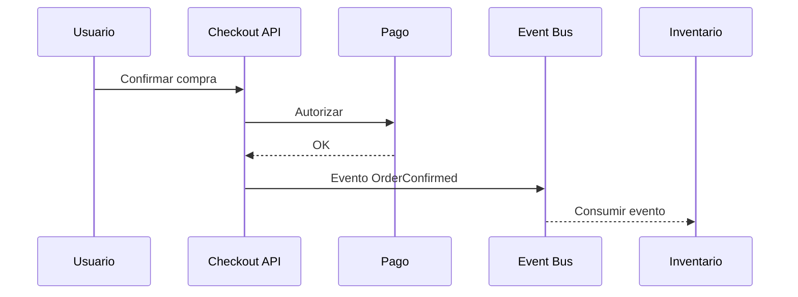

# 04 - Patrones de Integracion

## Resumen ejecutivo (1 pagina)

- Integrar bien es equilibrar latencia, desacoplamiento y confiabilidad.
- Sincrono y asincrono no compiten: se combinan segun criticidad del flujo.
- EIP ofrece lenguaje comun para resolver problemas de mensajeria recurrentes.
- Integraciones robustas requieren contratos versionados, idempotencia y trazabilidad end-to-end.
- El exito se mide por continuidad de negocio, no solo por "mensajes entregados".

## 1) Mapa de integracion

| Tipo | Ejemplos | Ventaja | Riesgo |
| --- | --- | --- | --- |
| Sincrona | REST, gRPC | Simplicidad mental | Acoplamiento temporal |
| Asincrona | Pub/Sub, colas | Resiliencia y desacoplamiento | Complejidad de trazas |
| Datos | ETL/ELT, CDC | Escala analitica | Inconsistencia temporal |

## 2) EIP (Enterprise Integration Patterns) esenciales

- Message Channel
- Content-Based Router
- Splitter / Aggregator
- Dead Letter Channel
- Idempotent Receiver

## 3) Sincrono vs asincrono

| Criterio | Sincrono | Asincrono |
| --- | --- | --- |
| UX inmediata | Excelente | Requiere feedback diferido |
| Tolerancia a fallos remotos | Baja | Alta |
| Complejidad operativa | Menor | Mayor |
| Escalado por picos | Limitado | Muy bueno |

## 4) Ejemplo: checkout mixto

- Paso 1 (sincrono): validar carrito y pago.
- Paso 2 (asincrono): notificar inventario, facturacion, analitica.
- Paso 3: reconciliacion de eventos fallidos via DLQ.

## 5) Buenas practicas

- Contratos versionados (schema evolution).
- Correlation ID en todo mensaje.
- Reintentos con jitter y tope.
- Consumidores idempotentes por defecto.

## 6) Caso real end-to-end (ordenes, pagos e inventario)

### Problema

Se necesita confirmar orden en menos de 2 segundos sin perder consistencia operativa.

### Arquitectura mixta recomendada

- Sincrono para validacion critica (stock minimo, autorizacion de pago).
- Asincrono para actividades secundarias (email, analitica, recomendaciones).
- Outbox para asegurar publicacion de eventos.

### Tabla de seleccion de patron

| Necesidad | Patron | Justificacion |
| --- | --- | --- |
| Confirmacion inmediata al cliente | Request/Response | UX directa |
| Procesos desacoplados | Pub/Sub | Escala por consumidores |
| Evitar perdida de eventos | Outbox + DLQ | Confiabilidad |
| Integrar legado | Adapter + ACL | Protege modelo de dominio |

### KPIs

- Latencia de confirmacion de orden.
- Lag de consumidor.
- Tasa de mensajes en DLQ.
- Eventos duplicados detectados.

## 7) Preguntas de entrevista

- Como decides que parte de un flujo va sincrona vs asincrona?
- Como manejas versionado de eventos sin romper consumidores?
- Que haria fallar una integracion aun con broker robusto?

## 8) Errores tipicos en entrevistas

- Elegir todo sincrono o todo asincrono sin justificar.
- No contemplar idempotencia ni manejo de duplicados.
- Omitir versionado de contratos/eventos.
- Ignorar observabilidad y correlacion entre servicios.

## 9) Respuesta modelo para entrevista (2 minutos)

"Para integracion, combino sincrono y asincrono segun criticidad del flujo. Lo critico para UX va sincrono con timeouts estrictos; lo desacoplable va por eventos con idempotencia y contratos versionados. Uso EIP como lenguaje comun y evito acoplamiento temporal innecesario. En fiabilidad, aplico Outbox, DLQ y correlacion end-to-end. Mido exito con latencia de negocio, lag de consumidores, errores de integracion y tasa de reprocesos, no solo con throughput."

## 10) Dominios de integracion empresariales

| Dominio | Objetivo | Tecnologias/patrones tipicos |
| --- | --- | --- |
| Data Integration | mover y consolidar datos | ETL/ELT, CDC, MDM, DWH |
| Application Integration | conectar apps operativas | REST, gRPC, ESB, iPaaS |
| Process Integration (BPI) | coordinar procesos e2e | BPM, workflow engines, Saga |
| B2B Integration | intercambio entre empresas | EDI, AS2, APIs seguras |
| UI Integration | experiencia unificada | BFF, micro-frontends, portal |
| IoT/Edge Integration | integrar dispositivos | MQTT, CoAP, gateways edge |

## 11) Anti-patrones frecuentes

- Definir integracion solo por tecnologia y no por dominio/flujo.
- Usar shared database como integracion permanente.
- No versionar contratos de eventos.
- Publicar eventos sin ownership ni data contract.
