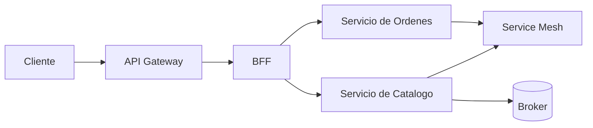

# 05 - Patrones de Middleware

## Resumen ejecutivo (1 pagina)

- Middleware desacopla capacidades transversales del codigo de negocio.
- API Gateway y BFF resuelven problemas distintos y se complementan.
- Service Mesh aporta estandarizacion de trafico interno, pero requiere madurez operativa.
- ESB sigue siendo util en legados complejos, aunque no es primera opcion cloud-native.
- La decision correcta depende de escala, diversidad de clientes y carga operativa aceptable.

## 1) Que problema resuelve el middleware

Quitar complejidad transversal de las aplicaciones: seguridad, transporte, enrutamiento, politicas, observabilidad.

## 2) Comparativa de opciones

| Patron/Componente | Capa | Uso principal | Error comun |
| --- | --- | --- | --- |
| API Gateway | Borde | AuthN/AuthZ, routing, quota | Meter logica de negocio |
| BFF | Canal cliente | Adaptar payload por cliente | Duplicar dominio |
| Broker | Mensajeria | Entrega asincrona | No manejar DLQ |
| ESB | Integracion legacy | Transformaciones complejas | Crear cuello de botella |
| Service Mesh | Trafico interno | mTLS, retries, policy | Falta de ownership |

## 3) Patrones por contexto

### API Gateway
- Centraliza politicas de entrada.
- Ideal para ecosistemas multi-cliente.

### BFF
- Optimiza experiencia por frontend (web/mobile/partner).
- Reduce round trips.

### Service Mesh
- Estandariza telemetria y seguridad service-to-service.
- Muy util en mallas grandes de microservicios.

## 4) Flujo de referencia

## 5) Criterios de seleccion

1. Complejidad de ecosistema.
2. Nivel de estandarizacion requerido.
3. Madurez del equipo de plataforma.
4. Costo operativo aceptable.

## 6) Caso real end-to-end (ecosistema multi-canal)

### Problema

Web y mobile consumen muchos servicios y generan sobrecarga de llamadas.

### Solucion

- API Gateway en borde para seguridad y politicas globales.
- BFF por canal para payload optimizado.
- Service Mesh para trafico interno y mTLS.
- Broker para eventos de dominio asincronos.

### Decision matrix

| Componente | Si usar cuando | Evitar cuando |
| --- | --- | --- |
| API Gateway | multiples clientes externos | app monolitica simple |
| BFF | necesidades distintas por canal | un solo cliente estable |
| Service Mesh | decenas de servicios | ecosistema pequeno |
| ESB | integracion legacy pesada | greenfield cloud-native |

### Riesgos operativos

- Acumulacion de logica en Gateway/BFF.
- Ownership difuso de politicas.
- Aumento de latencia por demasiados hops.

## 7) Preguntas de entrevista

- Donde pondrias autenticacion/autorizacion en esta arquitectura?
- Como evitas duplicar logica entre BFFs?
- Cuando Service Mesh no justifica su costo?

## 8) Errores tipicos en entrevistas

- Poner logica de negocio en gateway o malla de red.
- Tratar BFF como sustituto de arquitectura de dominio.
- Proponer Service Mesh en ecosistemas demasiado pequenos.
- No definir ownership de politicas transversales.

## 9) Respuesta modelo para entrevista (2 minutos)

"Middleware lo uso para sacar complejidad transversal del codigo de negocio. API Gateway resuelve politicas de borde; BFF optimiza experiencia por canal; Broker desacopla procesos; y Service Mesh estandariza trafico interno cuando la escala lo justifica. Evito meter logica de dominio en componentes de infraestructura y defino ownership claro de politicas. La decision la tomo por costo operativo, madurez de plataforma y valor tangible en latencia, seguridad y mantenibilidad."
