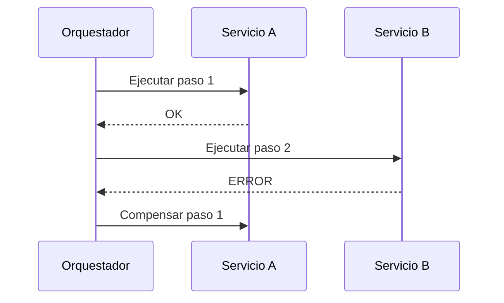

# 06 - Patrones de Resiliencia

## Resumen ejecutivo (1 pagina)

- Resiliencia significa continuidad de negocio bajo fallo parcial, no ausencia de errores.
- Timeout, retry con jitter y circuit breaker son base obligatoria en integraciones remotas.
- Bulkhead y backpressure evitan que un fallo local colapse todo el sistema.
- Sagas y compensaciones permiten consistencia en procesos distribuidos sin ACID global.
- Sin observabilidad y pruebas de fallo, los patrones de resiliencia son solo teoria.

## 1) Principio rector

Diseñar para fallar de forma controlada, observable y recuperable.

## 2) Patrones nucleares

| Patron | Que evita | Parametros clave |
| --- | --- | --- |
| Timeout | Esperas infinitas | timeout por dependencia |
| Retry + Jitter | Fallos transitorios | max retries, backoff |
| Circuit Breaker | Cascadas | threshold, cool-down |
| Bulkhead | Contagio de recursos | pools aislados |
| Fallback | Caida total de UX | respuesta degradada |
| Idempotencia | Duplicados | idempotency key |

## 3) Sagas y compensaciones

Cuando no existe transaccion distribuida ACID, se usan pasos locales con acciones de compensacion.

## 4) Tabla de degradacion esperada

| Escenario | Respuesta esperada | Resultado aceptable |
| --- | --- | --- |
| Pago lento | Timeout + fallback | Orden pendiente de confirmacion |
| Dependencia caida | Circuito abierto | Mensaje de servicio temporal |
| Cola saturada | Backpressure | Aplazar procesamiento |

## 5) Metrica minima de resiliencia

- Error rate por dependencia.
- Latencia p95/p99.
- Tasa de apertura de circuit breaker.
- Volumen en DLQ.
- MTTR por incidente.

## 6) Caso real end-to-end (caida de proveedor externo)

### Problema

El proveedor de pagos responde lento e intermitente durante hora pico.

### Respuesta arquitectonica

1. Timeout estricto por dependencia.
2. Retry con backoff y jitter (maximo acotado).
3. Circuit breaker para cortar cascada.
4. Fallback de estado "pago pendiente".
5. Reconciliacion posterior asincrona.

### Tabla de politicas recomendadas

| Patron | Valor inicial sugerido | Ajuste |
| --- | --- | --- |
| Timeout | 300-800ms | por SLA real de proveedor |
| Retry | 2-3 intentos | solo errores transitorios |
| Circuit breaker | threshold 30-50% | por volumen y criticidad |
| DLQ | retencion 7-14 dias | segun cumplimiento/auditoria |

## 7) Preguntas de entrevista

- Como defines un fallback "aceptable para negocio"?
- Que diferencia hay entre disponibilidad tecnica y continuidad de negocio?
- Cuando un retry empeora el incidente?

## 8) Errores tipicos en entrevistas

- Proponer retries infinitos sin limites ni jitter.
- No diferenciar fallos transitorios de fallos permanentes.
- Confundir "devolver 200" con resiliencia real.
- Omitir metricas clave (p95/p99, error budget, MTTR).

## 9) Respuesta modelo para entrevista (2 minutos)

"Resiliencia para mi significa mantener continuidad de negocio bajo fallo parcial. En llamadas remotas aplico timeout, retry con jitter y circuit breaker con parametros acotados por SLA. Aislo recursos con bulkheads y defino fallbacks que mantengan una UX aceptable. Para procesos distribuidos uso saga con compensaciones e idempotencia. No doy por validado nada sin observabilidad y pruebas de fallo; mido con p95/p99, error budget, volumen en DLQ y MTTR."

## 10) Clasificacion de errores para reintento

| Tipo de error | Reintentar | Ejemplo |
| --- | --- | --- |
| Transitorio | Si | timeout, 503, network blip |
| Permanente | No | 400, 404 semantico, validacion |
| Saturacion | Con control | 429 con backoff estricto |

## 11) Patrones operativos complementarios

- **DLQ:** aislar mensajes no procesables y habilitar reproceso controlado.
- **Correlation-ID:** trazar una transaccion completa entre APIs, colas y jobs.
- **Error budgets:** limitar cambios riesgosos cuando SLO cae.

## 12) Mini runbook de incidente de integracion

1. Identificar patron de fallo (latencia, error, duplicado, cola saturada).
2. Verificar trazas por correlation-id.
3. Aplicar contencion (abrir circuito, bajar traffic, fallback).
4. Corregir causa raiz y reprocesar DLQ.
5. Registrar aprendizaje en postmortem.
