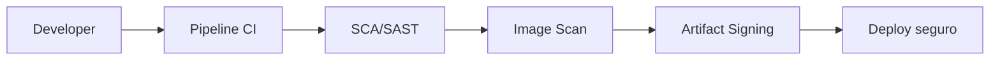

# 07 - Seguridad Arquitectonica

## Resumen ejecutivo (1 pagina)

- Seguridad arquitectonica se diseña desde el inicio y atraviesa todo el ciclo de vida.
- El principio central es minimo privilegio + verificacion continua (Zero Trust).
- Identidad robusta (OAuth2/OIDC, mTLS) y controles de API reducen superficie de ataque.
- La cadena de suministro (SBOM, escaneo, firma) es parte critica del riesgo tecnico.
- Seguridad efectiva equilibra proteccion, usabilidad operativa y velocidad de entrega.

## 1) Seguridad por diseno

La seguridad no es una fase final: se modela desde arquitectura, contratos y pipelines.

## 2) Identidad y acceso

| Mecanismo | Uso recomendado | Riesgo |
| --- | --- | --- |
| OAuth2/OIDC | Apps y APIs modernas | mala gestion de scopes |
| JWT | Token portable | expiracion y revocacion mal tratadas |
| mTLS | Service-to-service | gestion de certificados |
| RBAC/ABAC | Control de permisos | reglas complejas sin gobernanza |

## 3) Controles de integracion

- WAF en borde.
- Rate limiting y anti-bot.
- Firma de webhooks (HMAC).
- Proteccion contra replay attack (nonce + timestamp).

## 4) Secretos y cifrado

- Secret manager (no secretos en repo).
- Rotacion automatizada.
- TLS 1.2+ en transito.
- Cifrado en reposo con llaves gestionadas.

## 5) Supply chain security

- SBOM por build.
- SAST/DAST/SCA.
- Escaneo de imagenes.
- Politicas de firma y provenance.

## 6) Caso real end-to-end (API B2B)

### Problema

Exponer APIs a partners externos sin comprometer datos sensibles ni disponibilidad.

### Controles aplicados

- OAuth2 Client Credentials para M2M.
- mTLS entre partner y gateway.
- Scopes granulares por recurso.
- Rate limiting por cliente.
- Auditoria de acceso y trazabilidad completa.

### Matriz de amenazas y controles

| Amenaza | Control principal | Evidencia |
| --- | --- | --- |
| Robo de credenciales | rotacion + secreto gestionado | logs de rotacion |
| Replay attack | nonce + timestamp | validacion en gateway |
| Exceso de trafico | rate limiting + WAF | dashboard de quotas |
| Exfiltracion | cifrado + least privilege | revisiones de acceso |

## 7) Preguntas de entrevista

- Como disenas auth para servicio-servicio y para usuarios finales?
- Que diferencia operativa hay entre RBAC y ABAC?
- Como pruebas seguridad sin frenar el delivery?

## 8) Errores tipicos en entrevistas

- Tratar seguridad como etapa final de QA.
- Confundir autenticacion con autorizacion.
- No contemplar gestion y rotacion de secretos.
- Proponer controles sin estrategia de auditoria y respuesta.

## 9) Respuesta modelo para entrevista (2 minutos)

"Abordo seguridad como parte de la arquitectura desde el dia cero. Defino identidad y acceso con OAuth2/OIDC, scopes de minimo privilegio y mTLS para trafico interno critico. En integraciones aplico rate limiting, firma de webhooks y controles anti-replay. En supply chain, exijo SBOM, escaneo y firma de artefactos. Mi objetivo es equilibrar proteccion y delivery: seguridad medible, automatizada y auditable en pipeline y runtime."

## 10) Mecanismos de autenticacion y seguridad en integraciones

| Capa | Mecanismo | Objetivo |
| --- | --- | --- |
| Identidad | OAuth2/OIDC, mTLS, API Keys | autenticar cliente/sistema |
| Autorizacion | RBAC, ABAC, scopes | limitar acciones permitidas |
| Canal | TLS 1.2+, mTLS | confidencialidad e integridad |
| Borde | API Gateway + WAF | control y proteccion centralizada |
| Secretos | Vault/Secret Manager | evitar hardcode y rotar credenciales |
