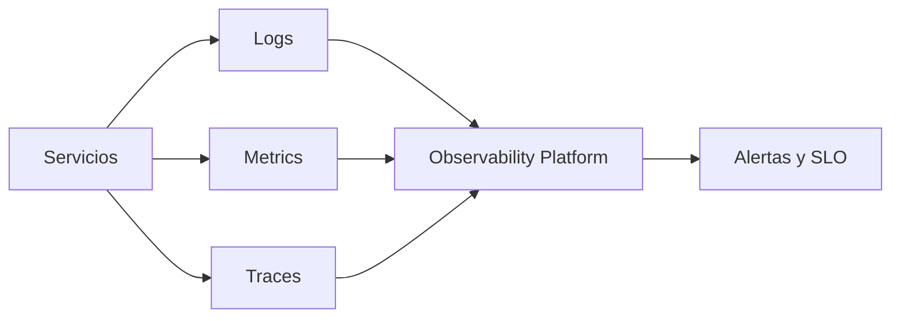

# 08 - Plataforma, Operacion y Observabilidad

## Resumen ejecutivo (1 pagina)

- La plataforma debe reducir friccion y estandarizar buenas practicas para todos los equipos.
- CI/CD confiable y despliegue progresivo son capacidades de negocio, no solo tecnicas.
- Observabilidad exige correlacion entre logs, metricas y trazas con contexto de producto.
- SLOs convierten confiabilidad en compromisos medibles y gestionables.
- Operacion madura combina automatizacion, runbooks y aprendizaje post-incidente.

> Alcance: este documento define estrategia operativa.  
> Catalogo de herramientas: ver `19 - Herramientas de Monitoreo y Observabilidad`.  
> Profundizacion en plataforma: ver `20 - Kubernetes para Arquitectura`.

## 1) Plataforma como producto interno

La plataforma debe reducir carga cognitiva del equipo de producto y estandarizar buenas practicas.

## 2) Kubernetes y despliegue

| Tema | Practica recomendada |
| --- | --- |
| Deployments | Estrategias rolling/canary |
| Ingress/API | politicas de seguridad y trafico |
| Escalado | HPA/VPA con metricas reales |
| Configuracion | Helm/Kustomize + GitOps |

## 3) CI/CD y calidad de entrega

- Build reproducible.
- Tests de contrato y smoke tests en pre-prod.
- Progressive delivery (canary, blue/green).
- Rollback automatizado por umbral de error.

## 4) Observabilidad (3 pilares + contexto)

- Logs estructurados.
- Metrics de negocio y sistema.
- Traces distribuidos.
- Correlation ID en extremo a extremo.

## 5) Operacion basada en SLO

| Indicador | Ejemplo |
| --- | --- |
| SLI | disponibilidad de API |
| SLO | 99.9% mensual |
| Error Budget | 43.2 min/mes de indisponibilidad |

## 6) Practicas de confiabilidad

- On-call con runbooks.
- Postmortem sin culpa.
- Ingenieria de caos controlada.

## 7) Caso real end-to-end (incidente en produccion)

### Problema

Aumento de errores 5xx y latencia p99 durante despliegue parcial.

### Respuesta de plataforma

1. Canary deployment con 5% de trafico.
2. Alertas por SLO breach, no solo CPU.
3. Rollback automatico al exceder umbral de error.
4. Analisis de traces para causa raiz.
5. Postmortem con acciones de prevencion.

### KPIs de operacion

| KPI | Objetivo |
| --- | --- |
| MTTR | < 30 min |
| Change failure rate | < 10% |
| Frecuencia de deploy | diaria o superior |
| SLO cumplimiento | >= 99.9% |

## 8) Preguntas de entrevista

- Como defines un SLO util para negocio?
- Que senales usas para rollback automatico?
- Que diferencia hay entre monitoreo y observabilidad?

## 9) Errores tipicos en entrevistas

- Medir infraestructura sin medir experiencia de usuario.
- Alertar por ruido tecnico y no por impacto real.
- No definir estrategia de rollback.
- Describir Kubernetes como fin y no como medio.

## 10) Respuesta modelo para entrevista (2 minutos)

"Veo la plataforma como un producto interno que reduce carga cognitiva y acelera entrega segura. Estandarizo CI/CD con despliegues progresivos, rollback automatico y controles de calidad por entorno. En operacion, priorizo SLOs de negocio y observabilidad integral con logs, metricas y trazas correlacionadas. Mi enfoque de confiabilidad combina automatizacion, runbooks y postmortems sin culpa para aprender rapido y bajar recurrencia de incidentes."

## 11) OpenTelemetry y estandarizacion

- Unificar instrumentacion de logs, metricas y trazas.
- Desacoplar codigo de proveedores de observabilidad.
- Facilitar migracion de backend de monitoreo sin refactor masivo.

## 12) Observabilidad frontend (RUM)

- Captura de errores cliente (JS runtime, fallos de red).
- Medicion de Core Web Vitals (LCP, CLS, INP).
- Correlacion frontend-backend con trace/correlation IDs.

## 13) Control de costo de observabilidad

| Tecnica | Beneficio |
| --- | --- |
| Sampling de trazas | reduce costo de almacenamiento |
| Politica de retencion por criticidad | evita crecimiento descontrolado |
| Niveles de log por entorno | menos ruido y menos gasto |

## 14) Probes de Kubernetes

- **Liveness:** detecta proceso muerto y reinicia contenedor.
- **Readiness:** evita enviar trafico a pods no listos.
- **Startup:** protege arranques lentos (ej. apps Java pesadas).
