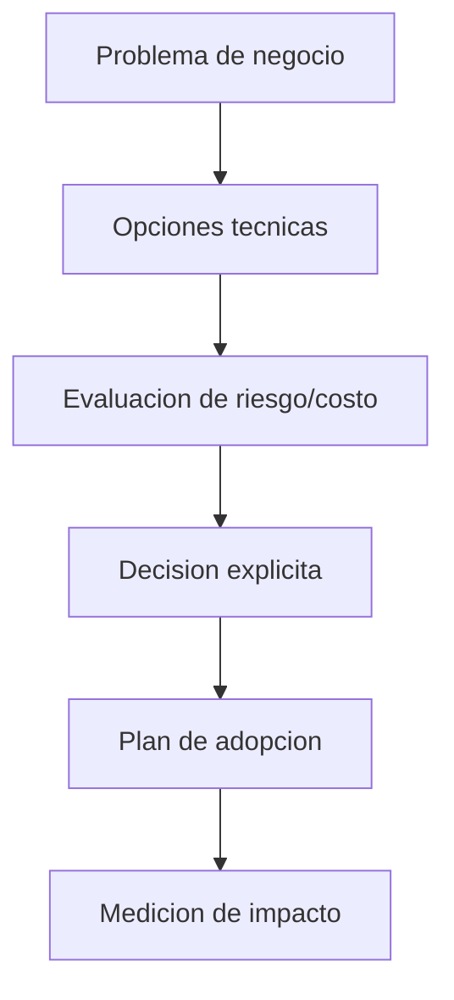

# 09 - Gobierno Arquitectonico y Liderazgo Staff/Tech Lead

## Resumen ejecutivo (1 pagina)

- Gobierno arquitectonico no es burocracia: es alineacion tecnica para escalar con calidad.
- ADR, RFC y guardrails hacen explicitas las decisiones y evitan deuda invisible.
- Un Staff/Lead conecta estrategia de negocio con decisiones tecnicas ejecutables.
- La madurez se observa en autonomia de equipos con coherencia sistémica.
- Liderazgo tecnico efectivo combina criterio, influencia y desarrollo de talento.

## 1) Gobierno arquitectonico pragmatico

No busca burocracia, busca coherencia tecnica y velocidad sostenible.

## 2) Artefactos de gobierno

| Artefacto | Proposito | Cadencia |
| --- | --- | --- |
| ADR | Registrar decisiones y trade-offs | Por decision relevante |
| RFC | Debatir cambios de alto impacto | Antes de implementar |
| Tech Radar | Guiar adopcion tecnologica | Trimestral |
| Standards | Reducir variabilidad inutil | Continua |

## 3) Liderazgo tecnico en la practica

- Traducir objetivos de negocio a decisiones tecnicas.
- Priorizar deuda tecnica por riesgo, no por opinion.
- Coordinar equipos para evitar optimizaciones locales.
- Elevar el nivel tecnico mediante mentoring estructurado.

## 4) Modelo de decision para Staff/Lead

## 5) Senales de madurez de liderazgo

- Roadmap tecnico alineado a roadmap de producto.
- Definicion de guardrails claros para equipos.
- Menor tiempo de incidentes repetitivos.
- Mayor autonomia tecnica por dominio.

## 6) Caso real end-to-end (portfolio multi-equipo)

### Problema

Tres equipos construyen soluciones similares con stacks distintos y sin estandares comunes.

### Enfoque de gobierno

- Definir principios de arquitectura obligatorios.
- Crear tech radar para tecnologias recomendadas.
- Estandarizar observabilidad, seguridad y CI/CD.
- Mantener excepciones con ADR y fecha de revision.

### Tabla de gobernanza

| Mecanismo | Objetivo | Riesgo si falta |
| --- | --- | --- |
| ADR | trazabilidad de decisiones | deuda invisible |
| RFC | alineacion previa | retrabajo |
| Guardrails | consistencia minima | fragmentacion |
| Arquitectura review | calidad sistemica | decisiones locales suboptimas |

## 7) Preguntas de entrevista

- Como equilibras autonomia de equipos y estandarizacion?
- Como priorizas deuda tecnica frente a nuevas features?
- Que indicadores muestran que el gobierno esta funcionando?

## 8) Errores tipicos en entrevistas

- Hablar de liderazgo sin ejemplos de decisiones dificiles.
- Proponer estandares sin mecanismo de adopcion real.
- No medir impacto del gobierno tecnico.
- Confundir control centralizado con liderazgo efectivo.

## 9) Respuesta modelo para entrevista (2 minutos)

"Gobierno arquitectonico para mi es habilitar autonomia con coherencia, no burocracia. Uso ADR y RFC para hacer explicitas decisiones y trade-offs, y guardrails para reducir variabilidad innecesaria. Como Staff/Lead conecto objetivos de negocio con decisiones tecnicas priorizadas por riesgo e impacto. Mido resultados en lead time, incidentes repetitivos, velocidad de onboarding y alineacion entre equipos. Liderazgo tecnico efectivo es influencia con evidencia, no autoridad sin contexto."
