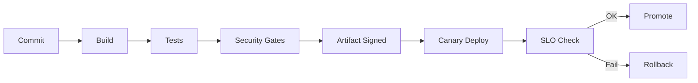

# 16 - DevOps/CI-CD para Arquitectura

## Resumen ejecutivo (1 pagina)

- DevOps/CI-CD es una capacidad de arquitectura para reducir riesgo de cambio.
- La meta no es "hacer pipelines", sino entregar valor frecuente con seguridad y trazabilidad.
- Un Staff/Lead define estandares de entrega, quality gates y politicas de rollback.

## 1) Pipeline de referencia (de izquierda a derecha)

1. Commit + validaciones locales.
2. Build reproducible.
3. Unit tests + lint + SAST.
4. Contract/integration tests.
5. Image scan + firma de artefactos.
6. Deploy progresivo (canary/blue-green).
7. Verificacion post-deploy por SLO.

## 2) Herramientas por capacidad

| Capacidad | Herramientas tipicas | Criterio de seleccion |
| --- | --- | --- |
| Orquestacion de pipeline | GitHub Actions, GitLab CI, Jenkins | integracion con repos + gobernanza |
| Calidad de codigo | SonarQube | quality gates y deuda tecnica |
| E2E y BDD | Playwright/Cypress, Cucumber | criticidad de journeys |
| IaC | Terraform | estandar multi-cloud |
| CD GitOps | ArgoCD | trazabilidad declarativa |

## 3) Estrategias de despliegue

| Estrategia | Fortalezas | Riesgo |
| --- | --- | --- |
| Rolling | simple y comun | deteccion lenta de regresion |
| Blue/Green | rollback rapido | mayor costo temporal |
| Canary | control fino de riesgo | requiere observabilidad madura |
| Feature flags | desacopla deploy/release | deuda de toggles si no se limpia |

## 4) Caso real end-to-end

### Problema
Releases quincenales con alto riesgo de rollback manual tardio y poca confianza.

### Solucion
Pipeline estandarizado + canary + quality gates + rollback automatico por SLO breach.

### KPIs
- Lead time for changes.
- Deployment frequency.
- Change failure rate.
- MTTR.

## 5) Errores tipicos en entrevistas

- Hablar de herramientas sin explicar controles de riesgo.
- No mencionar DORA metrics ni SLO post-deploy.
- Ignorar seguridad en el pipeline (supply chain).
- Asumir que "mas tests" siempre equivale a "mas calidad".

## 6) Preguntas de entrevista

- Como decides entre canary y blue/green?
- Que quality gates consideras no negociables?
- Como conectas CI/CD con SRE y error budget?

## 7) Respuesta modelo para entrevista (2 minutos)

"En DevOps/CI-CD diseno un flujo continuo con control de riesgo. Defino quality gates de codigo, seguridad y contratos; despliego con canary/blue-green; y promuevo o revierto segun impacto real en SLO. Mido con DORA metrics para detectar cuellos de botella y mejorar iterativamente. El objetivo es velocidad sostenible, no velocidad ciega."
