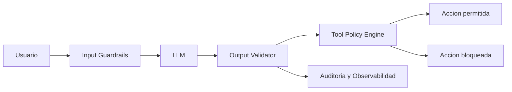

# 17 - Seguridad / OWASP Top 10 / OWASP Top 10 for LLM Applications

## Resumen ejecutivo (1 pagina)

- Seguridad web tradicional y seguridad de IA deben tratarse como una sola estrategia.
- OWASP Top 10 reduce riesgo de aplicaciones; OWASP LLM Top 10 reduce riesgo de sistemas con agentes/modelos.
- La arquitectura 10/10 define controles en SDLC, runtime y operacion.

## 1) OWASP Top 10 (aplicaciones web)

| Riesgo | Control recomendado | Evidencia esperada |
| --- | --- | --- |
| Broken Access Control | authz centralizada + pruebas de permisos | test de autorizacion en CI |
| Cryptographic Failures | cifrado correcto y gestion de llaves | politicas KMS + rotacion |
| Injection | validacion, prepared statements, WAF | cobertura SAST/DAST |
| Security Misconfiguration | hardening + baseline automatizado | scans de configuracion |
| Vulnerable Components | SCA + parcheo continuo | SBOM y alertas CVE |

## 2) OWASP Top 10 for LLM Applications (resumen)

| Riesgo LLM | Mitigacion base | Senal de control |
| --- | --- | --- |
| Prompt Injection | sanitizacion + aislamiento de herramientas | prompts bloqueados/auditados |
| Data Leakage | minimizacion de contexto + redaction | politicas de data handling |
| Insecure Output Handling | validacion y policy enforcement | capa de output filtering |
| Model/Dependency Supply Chain | provenance y versionado | firma y trazabilidad de modelos |
| Excessive Agency | permisos minimos para agentes | matriz RBAC por herramienta |

## 3) Arquitectura de controles para LLM

- Guardrails de entrada y salida.
- Tool-use policy con minimo privilegio.
- Observabilidad de prompts, decisiones y acciones.
- Human-in-the-loop para operaciones criticas.

## 4) Checklist por fase (SDLC)

| Fase | Controles minimos |
| --- | --- |
| Diseno | threat modeling + data classification |
| Build | SAST/SCA + secrets scanning |
| Release | firma de artefactos + aprobacion de cambios |
| Runtime | WAF, rate limit, deteccion anomalias |
| Operacion | auditoria, respuesta a incidentes, lecciones aprendidas |

## 5) Caso real end-to-end

### Problema
Asistente interno con acceso a datos sensibles y acciones automatizadas.

### Solucion
Zero trust + validacion por capas + RBAC por herramienta + auditoria de prompts y outputs.

### KPIs
- tasa de bloqueos de prompts maliciosos.
- incidentes de fuga de datos.
- tiempo de contencion de incidente.

## 6) Errores tipicos en entrevistas

- Tratar OWASP como checklist estatico sin contexto.
- No diferenciar riesgo web tradicional vs riesgo LLM.
- Permitir tool-use sin permisos granulares.
- Omitir evidencia operativa de controles.

## 7) Preguntas de entrevista

- Como priorizas hallazgos OWASP cuando hay mucha deuda?
- Que control pondrias primero para prompt injection?
- Como demuestras que seguridad no frena delivery?

## 8) Respuesta modelo para entrevista (2 minutos)

"Integro seguridad clasica y seguridad de LLM como arquitectura de control por capas. En web cubro OWASP Top 10 con controles automatizados en CI y runtime; en IA agrego guardrails, validacion de salida, tool permissions y trazabilidad total de decisiones. Mido efectividad con KPIs de incidentes y capacidad de contencion, para proteger datos sin frenar entrega."
