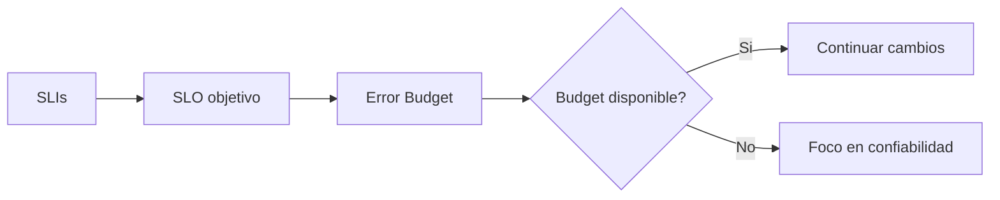

# 18 - SRE para Arquitectos y Tech Leads

## Resumen ejecutivo (1 pagina)

- SRE transforma confiabilidad en objetivos medibles y decisiones operativas.
- Arquitectura y SRE deben co-diseniarse: sin SLOs, no hay criterio de priorizacion confiable.

## 1) Fundamentos

- SLI: indicador medible.
- SLO: objetivo de calidad.
- Error budget: margen de falla permitido.

## 2) Practicas SRE clave

| Practica | Resultado |
| --- | --- |
| On-call con runbooks | respuesta rapida y consistente |
| Postmortem sin culpa | aprendizaje sistemico |
| Automatizacion de toil | mas tiempo en ingenieria de valor |
| Chaos engineering | validacion proactiva de resiliencia |

## 3) Politicas operativas

- Congelar cambios cuando error budget se consume.
- Priorizacion de deuda de confiabilidad.
- Revision periodica de SLOs por dominio de negocio.

## 4) Ejemplos de SLO por tipo de servicio

| Tipo de servicio | SLI | SLO sugerido |
| --- | --- | --- |
| API critica de pagos | disponibilidad | 99.95% mensual |
| API interna no critica | latencia p95 | < 300 ms |
| Pipeline batch | exito de ejecucion | 99.5% diario |

## 5) Caso real

### Problema
Incidentes frecuentes por dependencias externas durante picos.

### Solucion
SLO por flujo critico + error budget policy + simulacion de fallos + canary release.

### KPIs
- SLO compliance.
- MTTR.
- incidentes repetidos.

## 6) Errores tipicos en entrevistas

- Confundir monitoreo con SRE.
- Definir SLO sin relacion con experiencia de usuario.
- No usar error budget como mecanismo de priorizacion real.
- Omitir postmortems y accion correctiva verificable.

## 7) Preguntas de entrevista

- Como negocias objetivos de producto cuando el error budget se agotó?
- Que SLI elegirias para checkout y por que?
- Como evitas alert fatigue en on-call?

## 8) Respuesta modelo para entrevista (2 minutos)

"SRE para mi es el puente entre arquitectura y operacion. Defino SLOs por viaje critico, uso error budgets para decidir ritmo de cambio y automatizo respuesta operacional con runbooks y alertas accionables. Combinado con postmortems y chaos testing, esto reduce recurrencia de incidentes y mejora confiabilidad real percibida por el negocio."
