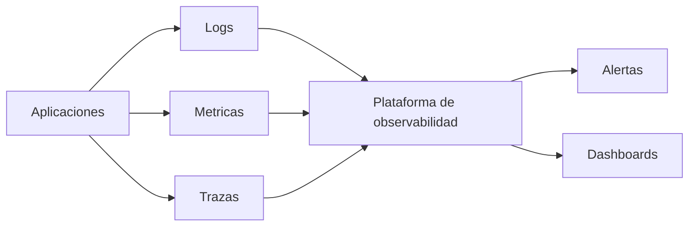

# 19 - Herramientas de Monitoreo y Observabilidad

## Resumen ejecutivo (1 pagina)

- Herramientas no reemplazan estrategia: deben responder preguntas operativas concretas.
- Combinar logs, metricas y trazas con ownership y SLOs claros.
- Este documento es **catalogo de herramientas**; la estrategia operativa vive en `08 - Plataforma, Operacion y Observabilidad`.

## 1) Mapa de herramientas

| Necesidad | Herramientas comunes | Uso recomendado |
| --- | --- | --- |
| Logs | ELK/EFK, Loki | analisis forense y troubleshooting |
| Metricas | Prometheus | SLI/SLO y alertas de salud |
| Dashboards/alertas | Grafana | paneles operativos unificados |
| Tracing | Jaeger, Zipkin | latencia y cuellos de botella distribuidos |
| APM full-stack | Dynatrace, Datadog, New Relic | visibilidad e2e con menor esfuerzo |

## 2) Criterios de seleccion

- Costo total (ingesta, retencion, consultas).
- Integracion con stack actual.
- Facilidad de adopcion por equipos.
- Requisitos de compliance/auditoria.

## 3) Tabla comparativa rapida

| Herramienta | Fortaleza | Limitacion comun |
| --- | --- | --- |
| ELK | busqueda profunda de logs | operacion propia costosa |
| Prometheus + Grafana | estandar open source | requiere curacion de paneles |
| Jaeger/Zipkin | trazas distribuidas | adopcion depende de instrumentacion |
| Dynatrace/Datadog | time-to-value rapido | costo a gran escala |

## 4) Referencia visual de stack de observabilidad

## 5) Anti-patrones

- Dashboards sin accion operativa.
- Alertas por sintomas tecnicos irrelevantes.
- Logs sin contexto (sin trace/correlation ID).
- Elegir herramienta por moda sin evaluar TCO.

## 6) Preguntas de entrevista

- Como eliges entre stack open source y APM comercial?
- Que criterios usas para definir retencion de datos?
- Como pruebas que una alerta es accionable?

## 7) Respuesta modelo para entrevista (2 minutos)

"Selecciono herramientas de monitoreo por casos de uso y costo operativo, no por popularidad. Defino una arquitectura de observabilidad con logs estructurados, metricas de negocio y trazas distribuidas correlacionadas. Establezco alertas accionables alineadas a SLO y reviso continuamente ruido/costo para mantener señal util."
