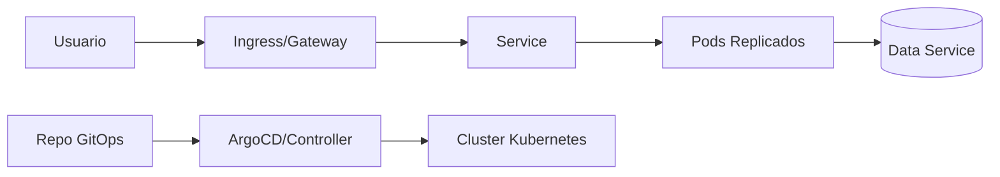

# 20 - Kubernetes para Arquitectura

## Resumen ejecutivo (1 pagina)

- Kubernetes es habilitador de resiliencia y escalado, no objetivo en si mismo.
- La arquitectura debe definir limites de responsabilidad entre aplicacion y plataforma.

## 1) Conceptos esenciales

| Concepto | Rol |
| --- | --- |
| Pod | unidad minima de ejecucion |
| Deployment | estado deseado y rollout |
| Service | endpoint estable interno |
| Ingress/Gateway | acceso externo y politicas |
| ConfigMap/Secret | configuracion y secretos |

## 2) Patrones operativos

- Health probes (`liveness`, `readiness`, `startup`).
- Horizontal autoscaling.
- Despliegues canary/blue-green.
- GitOps para control declarativo.

## 3) Arquitectura de referencia

## 4) Helm y estandarizacion

- Charts reutilizables por entorno.
- Valores parametrizados (`values.yaml`).
- Rollback rapido de release.

## 5) Decisiones clave para Staff/Lead

| Decision | Opcion A | Opcion B | Criterio |
| --- | --- | --- | --- |
| Multi-tenant | namespace por equipo | cluster por dominio | seguridad/costos |
| Entrega | rolling | canary/blue-green | criticidad y madurez |
| Escalado | HPA por CPU | HPA por metrica de negocio | tipo de carga |

## 6) Caso real

### Problema
Servicios con despliegues manuales inconsistentes entre ambientes.

### Solucion
Helm + GitOps + templates validados + politicas de rollout progresivo.

### KPIs
- tiempo de despliegue.
- tasa de rollback.
- drift entre ambientes.

## 7) Errores tipicos en entrevistas

- Presentar Kubernetes como solucion universal.
- Omitir costos operativos del cluster.
- No separar responsabilidades app vs plataforma.
- Ignorar seguridad de red y secretos.

## 8) Preguntas de entrevista

- Cuando NO recomendarias Kubernetes?
- Que probes usarias para una app Java de arranque lento?
- Como detectas y corriges drift entre entornos?

## 9) Respuesta modelo para entrevista (2 minutos)

"Uso Kubernetes para estandarizar despliegue y operacion, no para complejizar la plataforma. Defino manifiestos declarativos con GitOps, probes correctas y escalado guiado por metricas reales. Con Helm, reduzco drift entre entornos y acelero rollbacks. El foco es confiabilidad, repetibilidad y velocidad de entrega segura."
